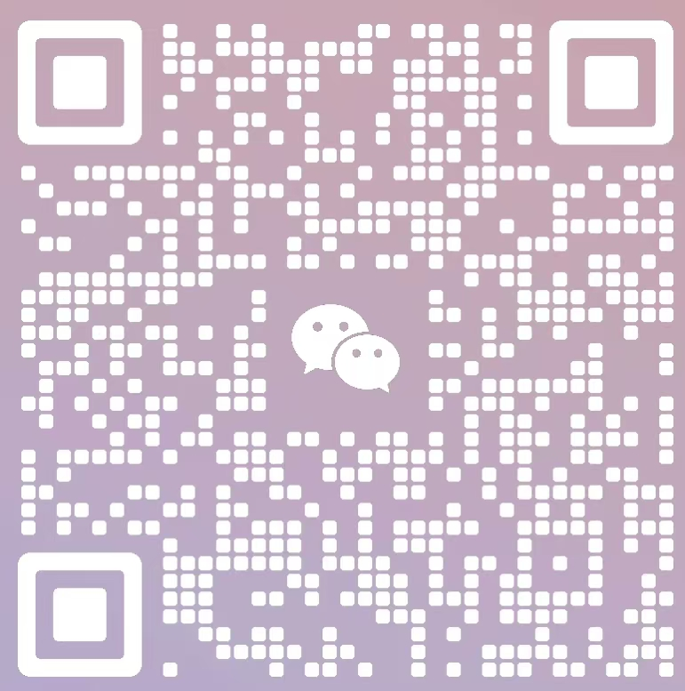

>陈纪元
>
>北京大学第三医院,100191
>
>188 0143 0995
>
>chenjiyuan@pku.edu.cn, chen@era.ac.cn
>
>http://era.ac.cn
>
>
>
>Chen Jiyuan
>
>Peking University Third Hospital,100191 
>
>Mobile: (+086) 188 0143 0995
>
>E-mail: chenjiyuan@pku.edu.cn, chen@era.ac.cn
>
>Website: http://era.ac.cn
