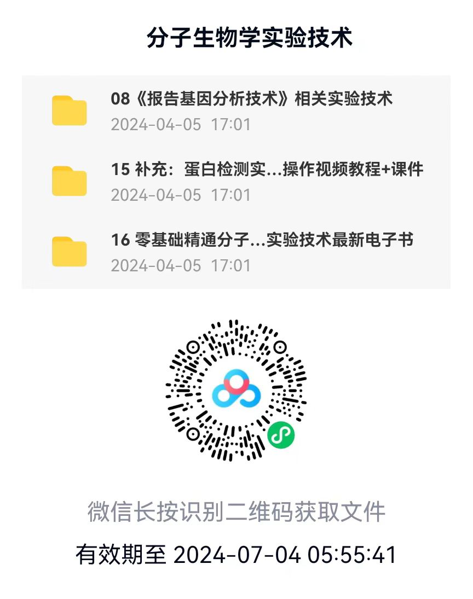

---  
title: "resources"  
date: 2023-07-06T10:00:00Z  
---  
 
  
  
  
      
  
  
  
  
      
  
  
  
  
      
  
  

  
  
  
      
  
  
  
  
      
  
  
  
  
      
  
  
  

 <!-- 清除浮动 -->  

  
  
  

